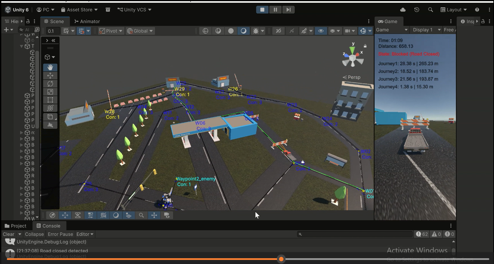

# Unity Autonomous Vehicle A* Pathfinding

This project is a Unity 3D autonomous vehicle simulation developed for an Intelligent Agents module. The vehicle navigates across a waypoint-based map using the A* pathfinding algorithm to calculate the shortest path between start and goal locations.

The simulation includes dynamic route handling, collision detection, obstacle response, and path recalculation. If a road becomes blocked, the vehicle waits briefly to check whether the path clears; if the obstruction remains, it recalculates an alternative route. The vehicle can also detect pedestrian-style obstacles and stop safely before continuing.

## Screenshot

## Features

* Autonomous vehicle navigation in Unity 3D
* A* shortest-path algorithm
* Waypoint graph with 35+ nodes
* Five journey scenarios with different start and goal points
* Dynamic path recalculation when roads are blocked
* Waiting behavior before rerouting
* Collision handling and obstacle response
* Pedestrian-style obstacle detection and stopping behavior
* Visual demonstration of intelligent agent decision-making

## Demo

[Watch Demo Video](https://www.linkedin.com/feed/update/urn:li:activity:7448423871994630144/)
